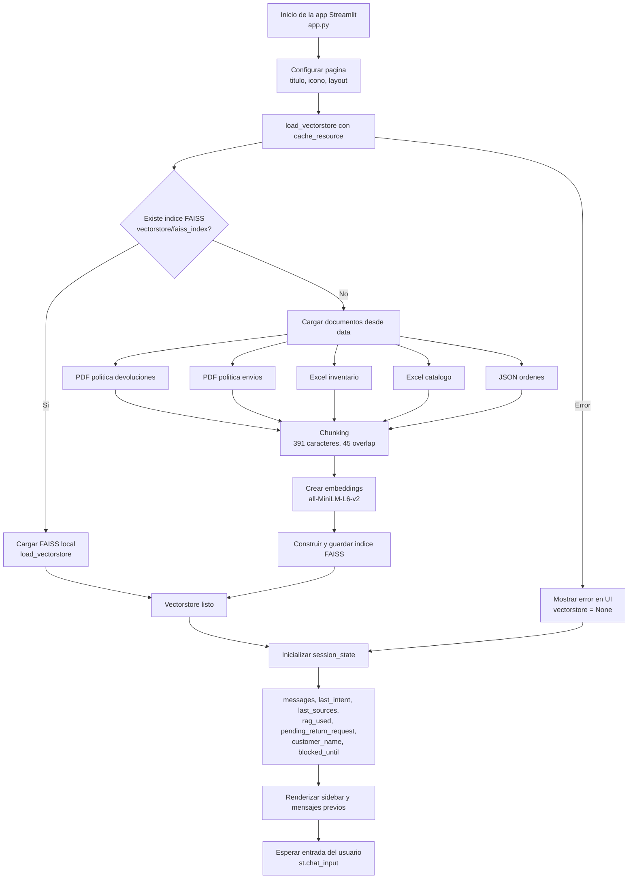
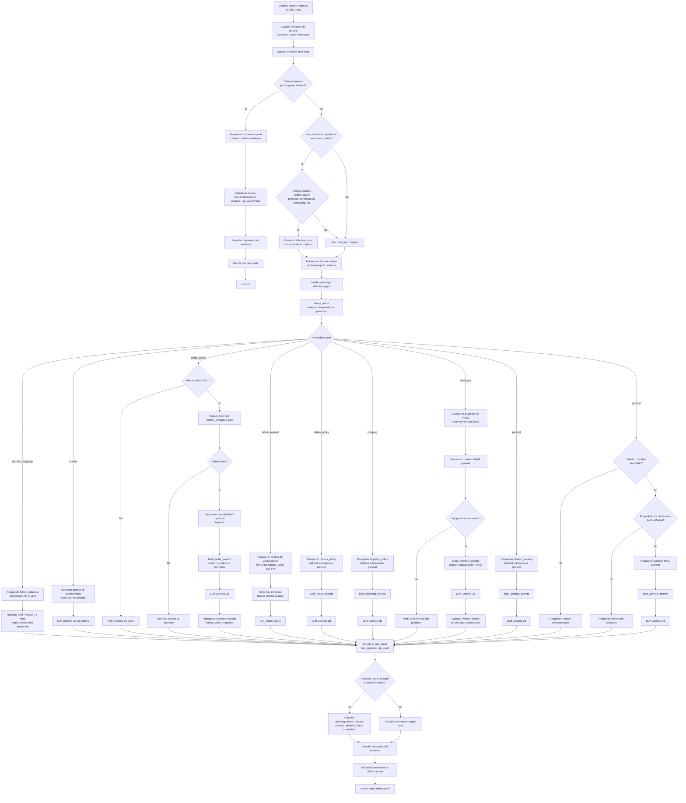
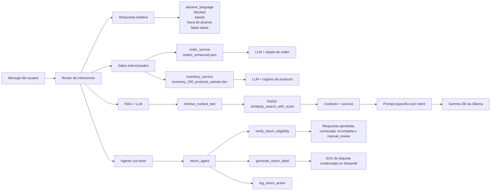
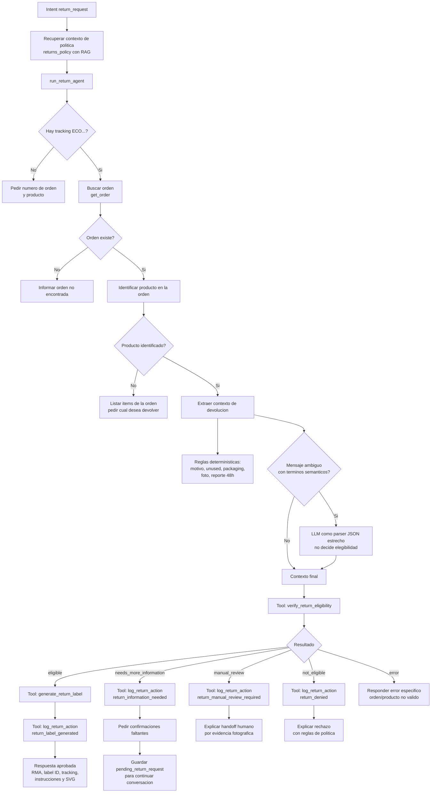
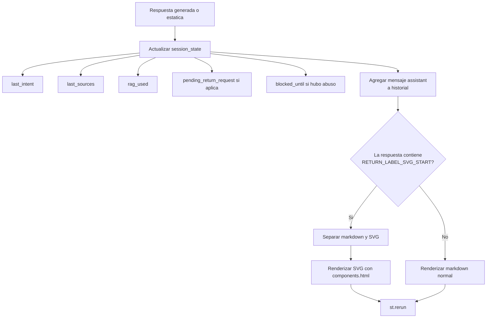

# Flujograma del flujo de trabajo del asistente EcoMarket

Este documento resume que ocurre desde que el usuario escribe un mensaje en la interfaz
hasta que recibe una respuesta. Esta pensado para sustentacion presencial: primero muestra
el flujo general, luego las ramas por intencion y finalmente el subflujo del agente de
devoluciones.

## 1. Inicializacion de la aplicacion

Antes de que el usuario envie mensajes, Streamlit prepara la interfaz y carga la base de
conocimiento.

Puntos clave para explicar:

- El vectorstore se carga una sola vez por sesion gracias a `@st.cache_resource`.
- Si el indice no existe, se construye desde los archivos de `data/`.
- Si la base vectorial falla, la app no se cae: algunas respuestas funcionan con datos
  estructurados o mensajes de degradacion.

## 2. Flujo principal desde mensaje hasta respuesta

Puntos clave para explicar:

- La primera decision importante es si el chat esta bloqueado por abuso.
- Despues se reconstruye el contexto de una devolucion pendiente, para que respuestas cortas como
  "yes, unused and packaging intact" no se pierdan.
- El router es deterministico y usa prioridad:
  `abusive_language > human > return_request > order_status > return_policy > shipping > inventory > product > general`.
- No todos los caminos usan RAG. Algunos usan datos estructurados, respuestas estaticas o ambos.
- Cuando se usa LLM, el prompt incluye reglas de grounding para reducir alucinaciones.

## 3. Ramas por tipo de respuesta

## 4. Subflujo del agente de devoluciones

Este es el flujo mas importante si te preguntan por agentes, tools y control de riesgo.

Decisiones de elegibilidad que aplica la tool:

- La orden debe existir.
- El producto debe pertenecer a la orden.
- La orden debe estar en estado `Delivered`.
- La solicitud debe estar dentro de la ventana de 30 dias desde la entrega estimada.
- El item debe estar sin usar y con empaque/etiquetas/accesorios intactos.
- Perecederos solo se aceptan si hay error de EcoMarket: danado, defectuoso, incorrecto,
  deteriorado o expirado al llegar.
- Casos que requieren fotos no generan etiqueta automaticamente; pasan a revision humana.

## 5. Que se muestra finalmente al usuario

## 6. Guion breve para sustentarlo

1. El usuario escribe en Streamlit y el mensaje se guarda en `st.session_state.messages`.
2. Antes de procesar, la app revisa si el chat esta bloqueado por lenguaje abusivo.
3. Si hay una devolucion pendiente, el sistema reconstruye el mensaje efectivo con el contexto
   anterior.
4. `handle_message` llama al router de intenciones.
5. Segun la intencion, el sistema puede:
   - responder de forma estatica,
   - consultar datos estructurados,
   - recuperar contexto con FAISS,
   - construir un prompt y llamar a Gemma 2B,
   - o ejecutar el agente de devoluciones con tools.
6. El LLM no recibe libertad total: se le pasa contexto recuperado, datos autorizados y reglas
   para no inventar.
7. En devoluciones, la decision critica no la toma el LLM sino `verify_return_eligibility`.
8. La respuesta final se guarda, se muestra en la UI y la app se refresca con `st.rerun`.

## 7. Preguntas que probablemente te pueden hacer

**Que pasa si el usuario pregunta algo fuera de EcoMarket?**  
El flujo `general` revisa palabras del dominio. Si no encuentra relacion con soporte de
EcoMarket, responde que solo puede ayudar con pedidos, envios, devoluciones, productos e
inventario.

**Que pasa si el usuario no da el numero de orden?**  
En `order_status` se pide el tracking. En `return_request` se pide tracking y producto.

**Que pasa si la base vectorial no carga?**  
`vectorstore` queda como `None`. Algunas rutas siguen funcionando con datos estructurados o
mensajes de fallback; las rutas de politica usan contexto no disponible o respuestas de
degradacion.

**Que evita que el modelo invente una politica?**  
Los prompts incluyen una regla de grounding: responder solo con la informacion proporcionada y
decir que no hay suficiente informacion si el contexto no alcanza.

**Por que hay un agente en devoluciones?**  
Porque no solo responde texto: verifica elegibilidad, puede generar una etiqueta simulada y deja
auditoria en logs. Esa accion requiere tools y reglas deterministicas.

**Donde queda la trazabilidad?**  
Las fuentes RAG se guardan en `last_sources` para la barra lateral, y las acciones del agente se
registran en `logs/return_agent_actions.jsonl`.
